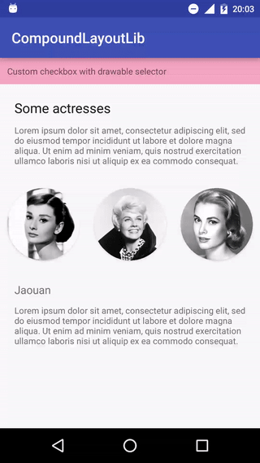

Android - CompoundLayout
========
[](https://jitpack.io/#Jaouan/CompoundLayout) [](https://android-arsenal.com/details/1/4171) [](https://android-arsenal.com/api?level=14)

It's an Android library that allows you to use Layout as RadioButton or CheckBox.
The librarie is Android 14+ compatible. Gradient effect is only Android 21+ compatible.


**The demo below is inspired by [Cris Samson's gradient hover animation](https://dribbble.com/shots/2892770-Gradient-hover-animation)**.




Installation
--------
Gradle

```java
repositories {
  	maven { url "https://jitpack.io" }
}
```

```java
compile 'com.github.jaouan:compoundlayout:1.0.1'
```


Usage
--------

#### General
*CompoundLayout* checked state can be changed programmatically using method **myCompoundLayout.setChecked()**.
Checked state can be retrieved using **myCompoundLayout.isChecked()**, and can be listened using **myCompoundLayout.setOnCheckedChangeListener()**.

#### Layout as CheckBox

```xml
<com.jaouan.compoundlayout.CompoundLayout
    android:layout_width="wrap_content"
    android:layout_height="wrap_content"
    android:background="@drawable/a_beautiful_selector"
    app:checked="true" > <!-- Checked or not -->

        <TextView
            android:layout_width="wrap_content"
            android:layout_height="wrap_content"
            android:text="Lorem ipsum" />

</com.jaouan.compoundlayout.CompoundLayout>
```

#### Layout as RadioButton
##### Basic
```xml
<com.jaouan.compoundlayout.RadioLayoutGroup
    android:layout_width="wrap_content"
    android:layout_height="wrap_content"
    app:orientation="horizontal"> <!-- Orientation : vertical or horizontal -->

    <com.jaouan.compoundlayout.RadioLayout
        android:layout_width="wrap_content"
        android:layout_height="wrap_content"
        android:background="@drawable/a_beautiful_selector"
        app:checked="true"> <!-- Checked or not -->

        <TextView
            android:layout_width="wrap_content"
            android:layout_height="wrap_content"
            android:text="Lorem ipsum" />

    </com.jaouan.compoundlayout.RadioLayout>

    <com.jaouan.compoundlayout.RadioLayout
        android:layout_width="wrap_content"
        android:layout_height="wrap_content"
        android:background="@drawable/a_beautiful_selector">

        <TextView
            android:layout_width="wrap_content"
            android:layout_height="wrap_content"
            android:text="Lorem ipsum" />

    </com.jaouan.compoundlayout.RadioLayout>

</com.jaouan.compoundlayout.RadioLayoutGroup>
```

##### Gradient effect (Android 21+ only)
```xml
<com.jaouan.compoundlayout.RadioLayoutGroup
    android:layout_width="wrap_content"
    android:layout_height="wrap_content"
    app:orientation="horizontal" > <!-- Orientation : vertical or horizontal -->

    <com.jaouan.compoundlayout.GradientRadioLayout
        android:layout_width="wrap_content"
        android:layout_height="wrap_content"
        app:checked="true"
        app:angle="45"
        app:colorA="#AAFFA726"
        app:colorB="#AAEC407A">

        <TextView
            android:layout_width="wrap_content"
            android:layout_height="wrap_content"
            android:text="Lorem ipsum" />

    </com.jaouan.compoundlayout.GradientRadioLayout>

    <!-- Circle clipped -->
    <com.jaouan.compoundlayout.CircleGradientRadioLayout
        android:layout_width="wrap_content"
        android:layout_height="wrap_content"
        app:angle="70"
        app:colorA="#AAFFA726"
        app:colorB="#AAEC407A">

        <TextView
            android:layout_width="wrap_content"
            android:layout_height="wrap_content"
            android:text="Lorem ipsum" />

    </com.jaouan.compoundlayout.CircleGradientRadioLayout>

</com.jaouan.compoundlayout.RadioLayoutGroup>
```

You can use **myGradientRadioLayout.setColorA()**, **myGradientRadioLayout.setColorB()** and **myGradientRadioLayout.setAngle()** to configure the gradient effect programmatically.


License
========

[Apache License Version 2.0](LICENSE)
